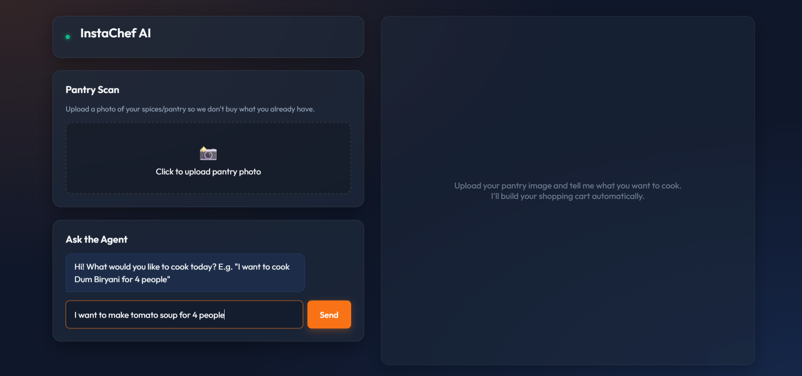
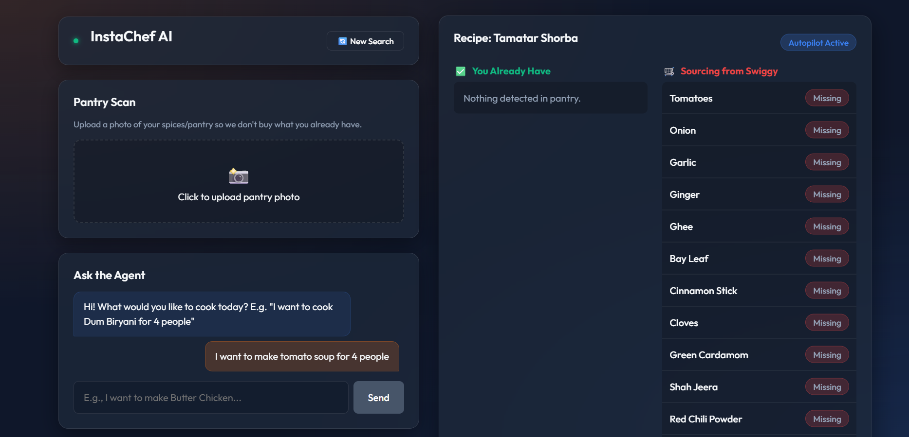
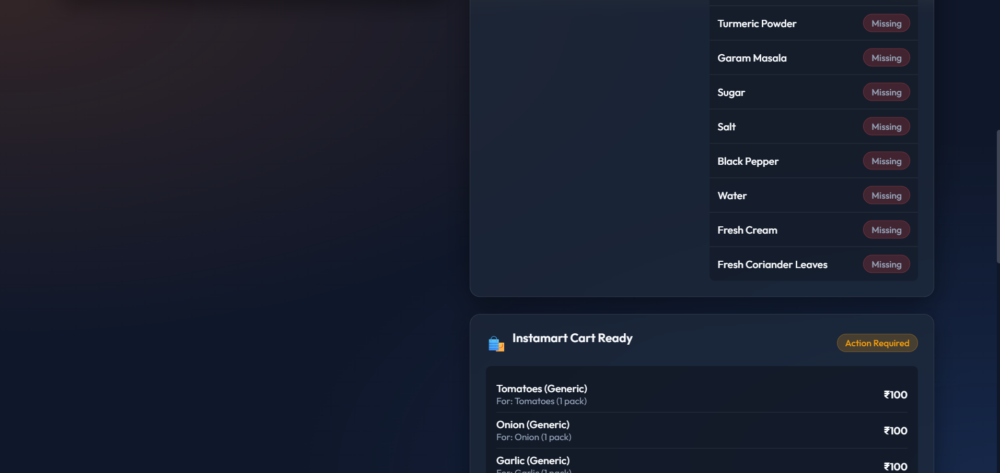
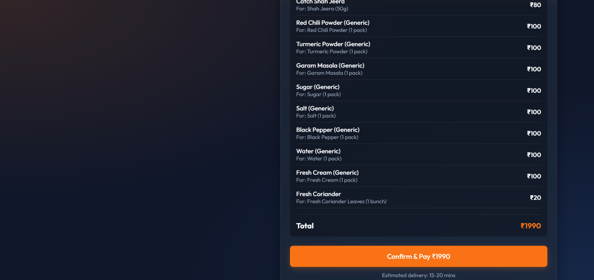

# InstaChef AI 👨‍🍳🛒

InstaChef AI is an autonomous, multimodal "Recipe-to-Cart" agent designed to make cooking authentic regional Indian dishes completely frictionless. It transforms natural language requests into structured recipes, scans your pantry using computer vision to see what you already have, and autonomously populates your Swiggy Instamart cart via the **Swiggy MCP (Model Context Protocol)** integration.

## How it Works
1. **Recipe Engine (Gemini 2.5 Flash)**: Generates highly authentic, region-specific Indian recipes from natural language prompts.
2. **Pantry Vision**: Analyzes an uploaded photo of your kitchen pantry to catalog existing ingredients.
3. **Diff Engine (Fuzzy Matching)**: Calculates the exact delta between what the recipe requires and what you already own.
4. **Swiggy MCP Integration**: Automatically talks to the Swiggy Instamart API (via the Builders Club MCP standard) to source and add the missing ingredients to your cart for instant delivery.

## Screenshots
<div align="center">
  
  
  
  
</div>

## Architecture
- **Frontend**: Premium Glassmorphism React interface built with Vite.
- **Backend**: Node.js / Express acting as an Agent Orchestrator.
- **AI Models**: Google Gemini 2.5 Flash for both text generation and multimodal vision.
- **Cart API**: `@modelcontextprotocol/sdk` wrapping the Swiggy Instamart API.

## Setup Instructions

### 1. Environment Variables
Create a `.env` file in the `backend/` directory:
```env
# Get from Google AI Studio (requires Google Cloud billing for high limits)
GOOGLE_API_KEY=your_gemini_api_key

# Get from Swiggy Builders Club
SWIGGY_BUILDERS_TOKEN=your_swiggy_token
```

### 2. Running the Backend
```bash
cd backend
npm install
node server.js
```

### 3. Running the Frontend
```bash
cd frontend
npm install
npm run dev
```

## Swiggy MCP Setup
The agent natively integrates with the Swiggy Model Context Protocol (MCP) spec. When the `SWIGGY_BUILDERS_TOKEN` is present, the agent connects directly to `mcp.swiggy.com/im` via SSE (Server-Sent Events). If the token is missing, the agent gracefully falls back to a locally simulated "Mock Instamart" to ensure development can continue without friction.
